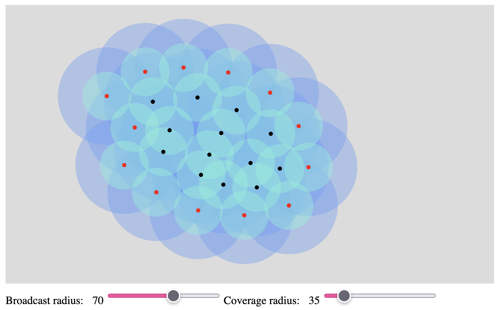
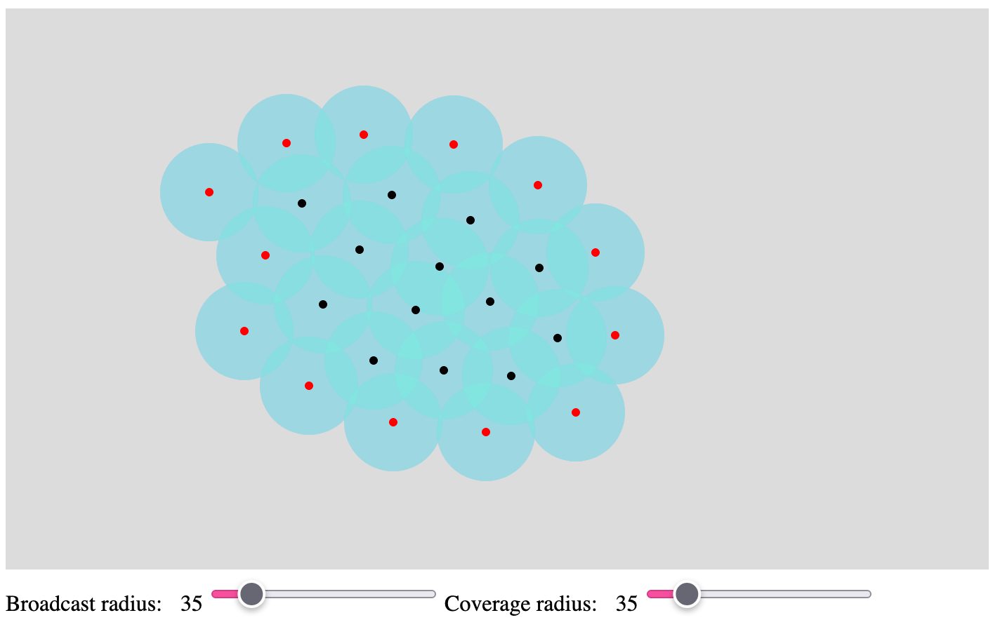

# Sensors coverage problem

Using Topological Data Analysis the problem of asking whether a set of sensors cover some region is solved. Two settings are considered, one where we do know about the exact location of sensors and one where we do not.

This is a partial implementation of the paper **_Coordinate-free coverage in sensor networks with controlled boundaries via homology_** by **V. De Silva** and **R. Ghrist**. [Link to paper](https://www.google.com/url?sa=t&rct=j&q=&esrc=s&source=web&cd=&cad=rja&uact=8&ved=2ahUKEwi4oYfhxPv8AhUFiYsKHSySAuUQFnoECAwQAQ&url=https%3A%2F%2Fwww2.math.upenn.edu%2F~ghrist%2Fpreprints%2Fcontrolledboundary.pdf&usg=AOvVaw3ieRB9hvCnTdFgJwRPD4_L).

This repository does not explain the concepts used from algebraic topology, it merely justifies their usage.

## Network creator

To create networks which we wish to consider, a visual creator is located in [network_creator](./network_creator), hosted at [shilangyu.dev/sensors-coverage/network_creator/](https://shilangyu.dev/sensors-coverage/network_creator/).

## Coordinate-full setting

Sensor coverage problem solved by means of homology of the Čech complex in a coordinate-full scenario. [See here](./analysis/coordinate_full_coverage.ipynb).

## Coordinate-free setting

Sensor coverage problem solved by means of the Rips complex and its relative homology in a coordinate-free scenario.. [See here](./analysis/coordinate_free_coverage.ipynb).

## Network examples

Sensor network with $r_c = r_b$ falling to cover the region (there are 4 1 dimensional holes).

Sensor network with $r_c = r_b$ covering the region.

